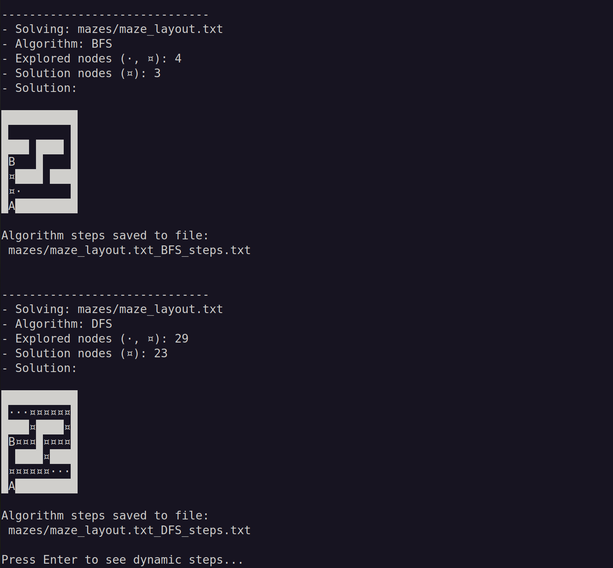

========================
What is *search* module?
========================

The Python *search* module is a versatile tool designed for solving problems involving state-space search, such as pathfinding or any scenario that requires intelligent exploration of states.

This module provides implementations of two fundamental search algorithms: Breadth-First Search (BFS) and Depth-First Search (DFS).

======================================
Watch *search* in action: maze solving
======================================

An illustrative example of the *search* module is its application to maze solving. In :doc:`Usage example <maze/usage_example_maze>`, you can find a complete Python script demonstrating how to solve mazes using the *search* module. Below is a preview of the script's output:

Static representation:
----------------------

First, a static representation of the maze, the search path, and the solution is presented for each algorithm: Breadth-First Search (BFS) and Depth-First Search (DFS).

Dynamic representation:
-----------------------
Next, a dynamic visualization of the search processes is provided. The accompanying video demonstrates how the search algorithms explore the maze step by step until a solution is found. Click the image below to watch the video.

.. video:: maze/maze_dynamic_solution.mp4
   :alt: maze_dynamic_solution
   :autoplay:
